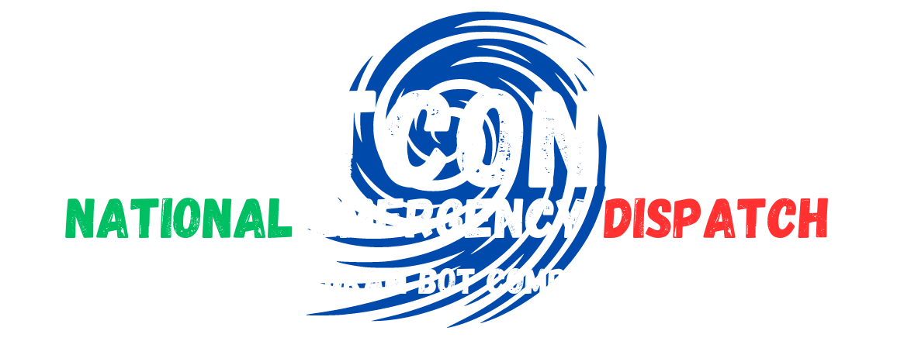

  

[circleci-image]: https://img.shields.io/circleci/build/github/nestjs/nest/master?token=abc123def456
[circleci-url]: https://circleci.com/gh/nestjs/nest

This project is telegram bot built with Node.js and Telegraf dedicated to check alerts every hour and send them to the registered users.

    
    

## Getting Started
Follow these instructions to set up the project on your local machine for development and testing purposes.
- Clone the repository to your local machine: `git clone https://github.com/prociv-sm/alert-queue.git`
- Install dependencies: `yarn install`
- Start the application in development: `yarn start:dev`
- Visit `http://localhost:3000` in your browser to use the application.

## Requirements
*  [Node.js](https://nodejs.org/en/download) 16.x.x or higher
*  [Yarn](https://yarnpkg.com/en) 1.10.1 or higher

## Built With
* [Node.js](https://nodejs.org/en/) - JavaScript runtime built on Chrome's V8 JavaScript engine.

## Contributing
Contributions are welcome! If you want to contribute to this project, please follow these steps:

- Fork the repository.
- Create a new branch (git checkout -b feature/your-feature).
- Make your changes.
- Commit your changes (git commit -am 'Add new feature').
- Push to the branch (git push origin feature/your-feature).
- Create a new Pull Request.

## Environment Variables
| code              | description            | default value                |
|-------------------|------------------------|------------------------------|
| BOT_TOKEN         | BotFather Bot token    |                              |
| API_BASE_URL      | API connector endpoint | http://localhost:8080/api/v1 |
| API_AUTH_KEY      | API connector auth key |                              |
| UPTIME_URL        | Uptime URL             |                              |
| UPTIME_KEY        | Uptime auth key        |                              |
| UPTIME_CHAT_TOKEN | Uptime token           |                              |

## Versioning
We use [SemVer](http://semver.org/) for versioning. For the versions available, see the [tags on this repository](https://github.com/andreacw5/url-manager-app/releases).

## Author
- [Andrea Tombolato](https://andreatombolato.dev)

## License
This project is licensed under the MIT License - see the [LICENSE](LICENSE.md) file for details
